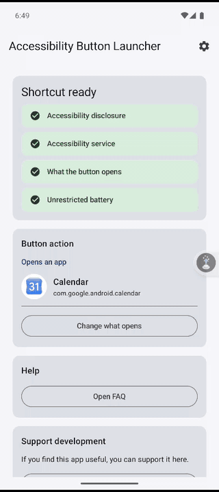
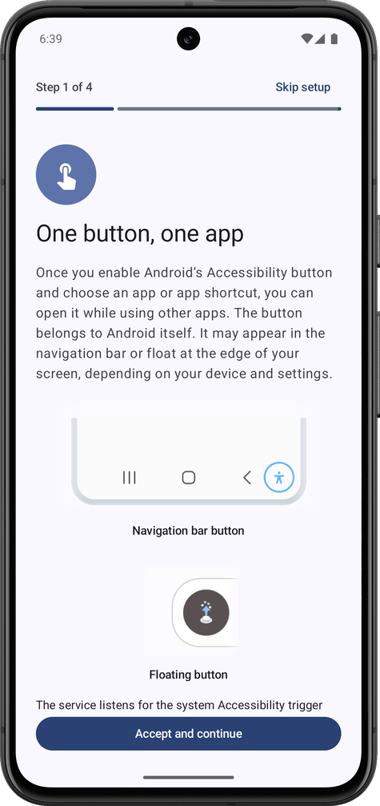

# Accessibility Button Launcher

[](https://github.com/pedronveloso/a11y-button-launcher-android/actions/workflows/ci.yml) [](https://github.com/pedronveloso/a11y-button-launcher-android/releases/latest)

**Accessibility Button Launcher** turns Android's built-in Accessibility button into a one-tap launcher for the app you use most. Choose an installed app, or an app shortcut such as composing a new message, and it opens from anywhere, even while you are using other apps.

The button belongs to Android itself. Depending on your device and settings, it appears in the navigation bar or floats at the edge of the screen, as shown in the screenshot below. If the chosen app is no longer available, the app opens and explains what needs to be fixed.

<table>
  <tr>
    <td align="center"></td>
    <td align="center"></td>
  </tr>
</table>

## What you can do with it

- **Circle to Search on Xiaomi with a third-party launcher.** Pair it with [MiCTS](https://github.com/parallelcc/MiCTS) and pick MiCTS as the app. One press starts Circle to Search, even though your launcher can't. MiCTS needs the Google app set as your default assistant.
- **Jot a note or task in one press.** Pick a shortcut like "New note" in your note or task app. Most of them offer one.
- **Scan a QR code.** Open a scanner app, or the scan shortcut in your camera app.
- **Start a message or email.** Use a shortcut like "Compose" in your mail app or "New message" in a chat app.
- **Open your 2FA authenticator.** One press and your codes are on screen.
- **Translate on the spot.** Open your translation app, or its camera or conversation mode if it has a shortcut for it.
- **Give a family member one simple button.** Point it at a video call or messaging app for someone who finds phones hard to use.

Which shortcuts you can pick depends on what each app offers. If an app has none, you can still launch the app itself.

## Install

Install the app from [F-Droid](https://f-droid.org/en/packages/com.pedronveloso.a11ybutton/), or download the APK from this repository's [GitHub Releases](https://github.com/pedronveloso/a11y-button-launcher-android/releases/latest).

## Requirements

- Android 11+ (API 30+)
- JDK 17

## Local development

```bash
./gradlew assembleDebug
./gradlew testDebugUnitTest
./gradlew lintDebug
./gradlew spotlessCheck
```

The main app module lives in `app/`. UI and screen state are Compose-driven, app settings are stored in DataStore, and the trigger entry point is `ShortcutLaunchAccessibilityService`.

## Setup flow

1. Open the app.
2. Read and accept the disclosure.
3. Open Accessibility settings and enable `A11Y Button Shortcut Service`.
4. Choose what the button opens: one launchable app, or one app shortcut (for example, composing a new message).
5. Use the system Accessibility button or shortcut to launch the selected app.

## Notes

- The service requests only the minimum accessibility configuration needed for the shortcut/button behavior.
- No telemetry, analytics, overlays, or multi-app automation are included in v1.
